# Tradyng — Multi-Store E-Commerce Platform

🛒 **Nigeria's All-in-One E-Commerce Platform for Entrepreneurs**

Tradyng is a powerful, scalable, and feature-rich multi-store e-commerce platform that lets anyone **build and launch a stunning online store in minutes**. Each business gets its own subdomain (`yourstore.tradyng.com`), a complete admin dashboard, product management, order processing, customer CRM, analytics, and more — all powered by **React**, **TypeScript**, and **Firebase**.

## 🌐 Live Platform

Experience the platform live at: **[https://rady.ng](https://rady.ng)**

---

## 🌟 Visual Showcase

### 🖥️ Modern Landing Page
A professional, conversion-optimized landing page with bold typography, smooth animations, and clear value propositions to attract new store owners.

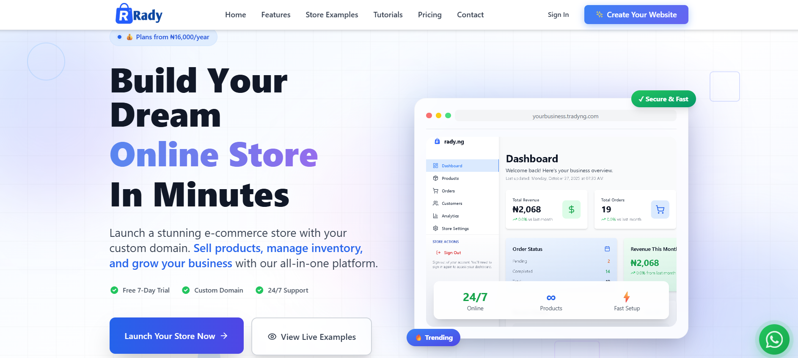
*Build your dream online store in minutes — with a free 7-day trial, custom domains, and 24/7 support.*

### ✨ All-in-One Platform Features
Everything a business needs to run and grow — from a powerful admin dashboard to customer management and advanced analytics — all presented beautifully on the features section.

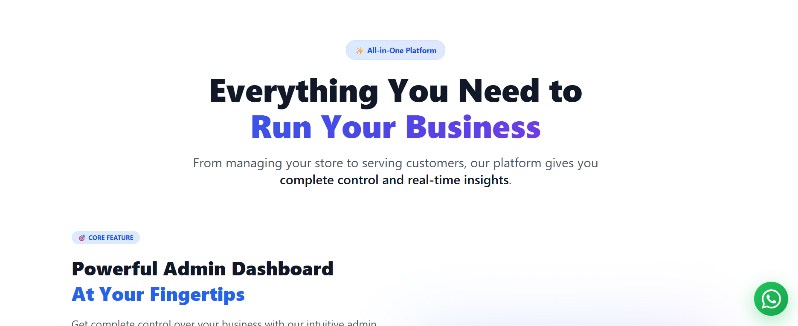
*"Everything You Need to Run Your Business" — complete control and real-time insights.*

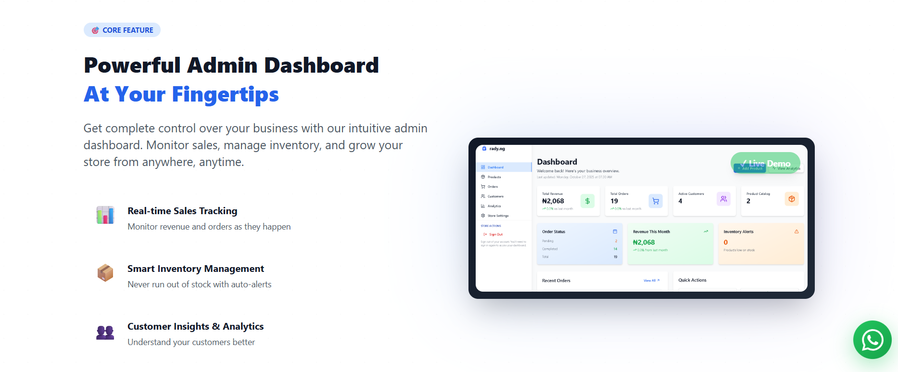
*Powerful Admin Dashboard with real-time sales tracking, smart inventory management, and customer insights.*

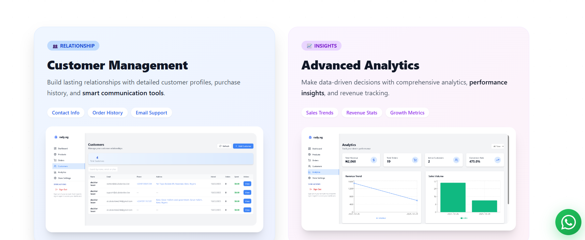
*Customer Management and Advanced Analytics — build lasting relationships and make data-driven decisions.*

### 💰 Flexible Pricing Plans
Transparent, tiered pricing designed for businesses of all sizes — with a free trial option and yearly savings.

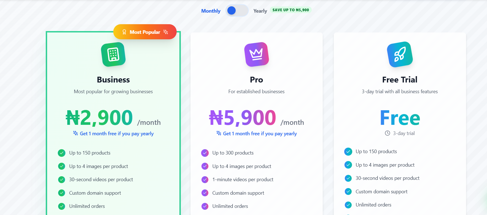
*Business (₦2,900/mo), Pro (₦5,900/mo), and Free Trial plans — with monthly/yearly toggle and up to ₦5,900 savings.*

### 🏪 Live Store Examples
Showcase real stores built with the platform, demonstrating store capabilities and giving new users confidence.

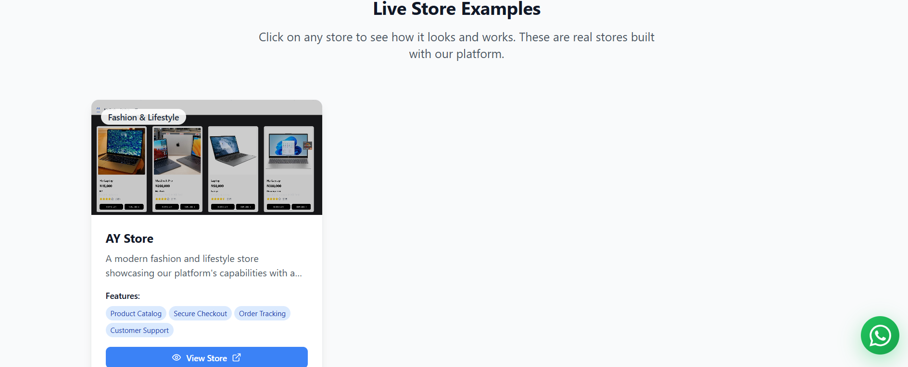
*Browse live store examples built on Tradyng — complete with product catalogs, secure checkout, and order tracking.*

---

## 🏬 Storefront Experience

### 🛍️ Beautiful Store Landing Page
Each store gets a fully customizable, branded landing page with hero sections, category filters, and a search bar.

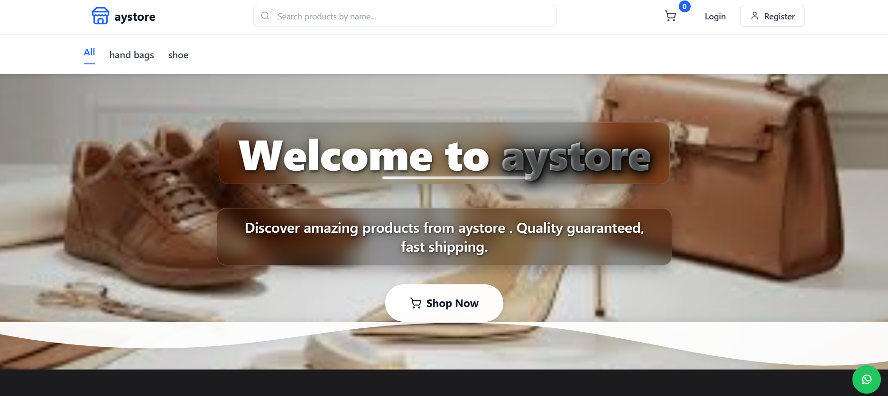
*Customizable storefront hero with category navigation, product search, and customer login/register.*

### 🎁 Product Catalog with Rich Cards
Products are displayed in beautiful, responsive cards with images, ratings, prices, and quick-action buttons.


*Elegant product grid with category badges, star ratings, Naira pricing, and instant "Add to Cart" buttons.*

### 🔍 Detailed Product Pages
Rich product detail pages with image/video galleries, size & color selectors, stock info, and social sharing.

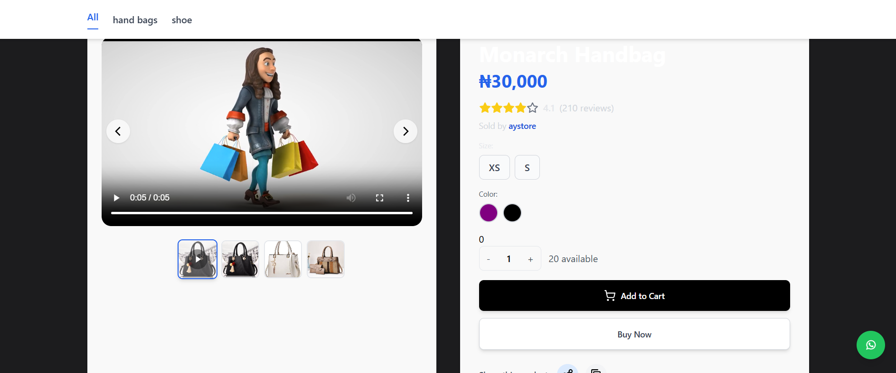
*Full product page with video support, image carousel, variant selection, and "Buy Now" or "Add to Cart" actions.*

### 🛒 Seamless Shopping Cart
A polished cart experience with quantity controls, item removal, order summary, free shipping badges, and one-click checkout.

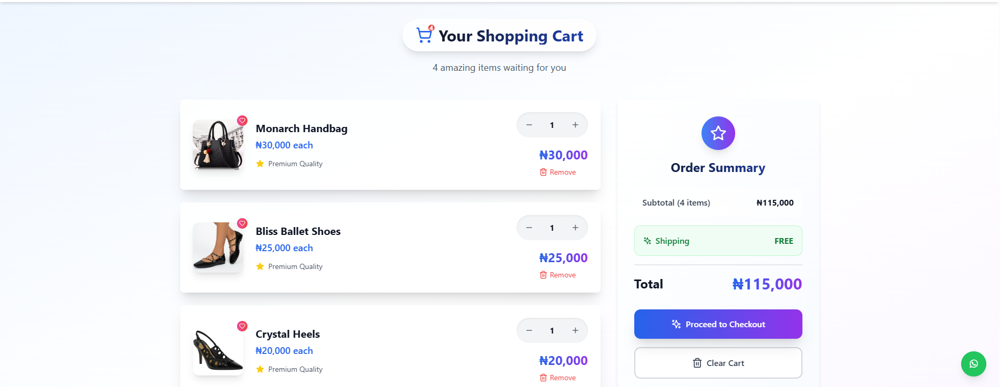
*Beautiful shopping cart with order summary, subtotal, free shipping, and "Proceed to Checkout" flow.*

---

## 👤 Customer Experience

### 📋 Order History & Tracking
Customers can view their complete order history with status tracking, payment details, and item breakdowns.

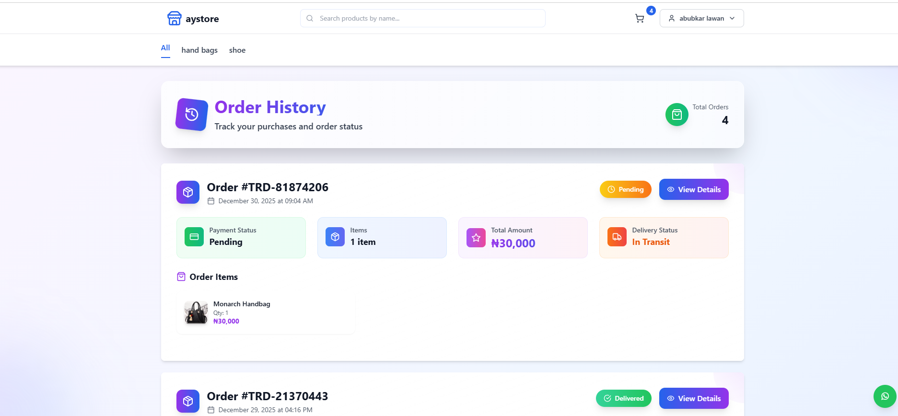
*Professional order history with order IDs, status badges (Pending, Delivered, In Transit), payment info, and item details.*

### 👤 Customer Profile
Full account management with personal information, delivery addresses, and order history access.

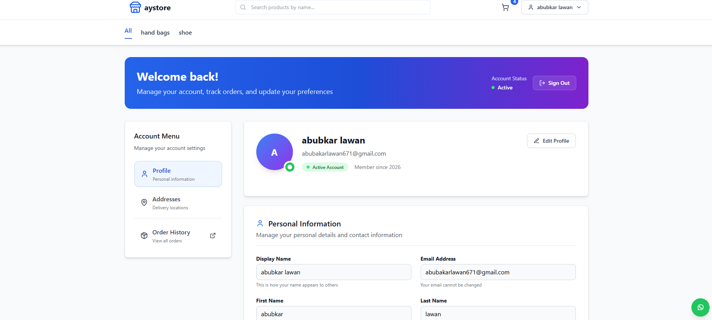
*Customer profile page with account menu, personal information management, and order history access.*

---

## 📊 Store Admin Dashboard

### 🛠️ Powerful Business Dashboard
Store owners get full control with a comprehensive dashboard showing revenue, orders, customers, products, inventory alerts, and quick actions.

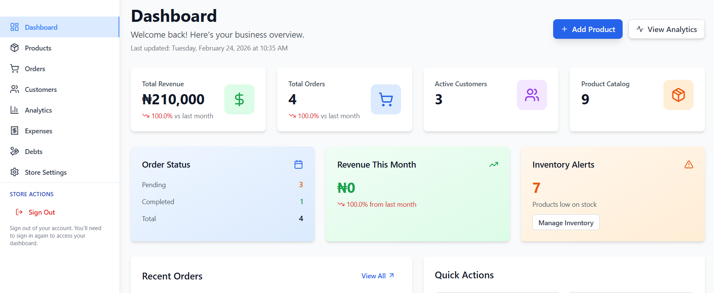
*Full-featured admin dashboard with Total Revenue, Total Orders, Active Customers, Product Catalog, Order Status, Revenue This Month, Inventory Alerts, Recent Orders, and Quick Actions.*

---

## ✨ Features

### Core Platform
- 🏪 **Multi-Store Architecture** — Multiple businesses, each with their own subdomain (`store.tradyng.com`)
- 🌐 **Custom Domain Support** — Connect your own domain to your store
- 🎨 **Custom Branding** — Customize logo, colors, and store appearance
- 📱 **Responsive Design** — Mobile-first, beautiful on all devices
- ⚡ **Blazing Fast** — Built with Vite for instant page loads

### Store Management
- 📦 **Rich Product Catalog** — Products with images, videos, variants, sizes, colors, and stock levels
- 🛒 **Complete Order Lifecycle** — Pending → Paid → Processing → Shipped → Delivered
- 👥 **Customer CRM** — Profiles, order history, addresses, and communication tools
- 📊 **Real-time Analytics** — Revenue trends, sales volume, conversion rates, and top products
- 📉 **Inventory Alerts** — Low-stock notifications to keep your store running smoothly
- 💸 **Expense & Debt Tracking** — Full financial management for your business

### Shopping Experience
- 🛍️ **Beautiful Storefront** — Hero sections, category filters, product search
- 🔍 **Product Details** — Image carousels, product videos, size/color variants, reviews
- 🛒 **Shopping Cart** — Quantity controls, order summary, seamless checkout
- 📋 **Order Tracking** — Customers track orders with real-time status updates
- 👤 **Customer Accounts** — Registration, profiles, addresses, order history

### Business Features
- 💳 **Payment Integration** — Flutterwave payment processing
- 📧 **Email Notifications** — Automated emails via SendGrid for orders, receipts, and alerts
- 🎫 **Coupon System** — Create and manage discount coupons
- 🤝 **Affiliate Program** — Built-in affiliate tracking and commission management
- 🔐 **Secure Authentication** — Firebase Auth with OTP and password reset
- 📄 **Receipt Generation** — Professional PDF receipts with html2pdf.js
- 🎓 **Tutorials System** — Built-in tutorials for store owners

---

## 🛠️ Tech Stack

### Frontend
- **Build Tool**: Vite 5
- **Library**: React 18
- **Language**: TypeScript
- **Styling**: Tailwind CSS
- **Animations**: Framer Motion
- **Icons**: Lucide React
- **Charts**: Recharts
- **Routing**: React Router DOM v7
- **Notifications**: React Hot Toast

### Backend & Infrastructure
- **Database**: Firebase Firestore (NoSQL)
- **Authentication**: Firebase Auth
- **File Storage**: Firebase Storage
- **Cloud Functions**: Firebase Functions (Node.js)
- **Deployment**: Vercel + Firebase Hosting

### Integrations & Services
- **Payments**: Flutterwave API
- **Emails**: SendGrid API
- **PDF Generation**: html2pdf.js
- **Image Cropping**: react-image-crop
- **Date Utilities**: date-fns

---

## 🚀 Getting Started

### Prerequisites
- **Node.js** 18.x or higher
- A **Firebase** project ([Firebase Console](https://console.firebase.google.com/))
- A **Flutterwave** account (Test/Live keys)
- **SendGrid** API key for transactional emails

### 1. Clone & Install
```bash
git clone https://github.com/alawantech/tradyng.git
cd tradyng
npm install
```

### 2. Environment Configuration
Copy the example environment file and fill in your credentials:

```bash
cp .env.example .env
```

Edit the `.env` file and add the following:

```env
# SendGrid Configuration
VITE_SENDGRID_API_KEY=your_sendgrid_api_key_here

# Firebase Configuration
VITE_FIREBASE_API_KEY=your_firebase_api_key
VITE_FIREBASE_AUTH_DOMAIN=your_project.firebaseapp.com
VITE_FIREBASE_PROJECT_ID=your_project_id
VITE_FIREBASE_STORAGE_BUCKET=your_project.appspot.com
VITE_FIREBASE_MESSAGING_SENDER_ID=123456789
VITE_FIREBASE_APP_ID=1:123456789:web:abcdef123456789
```

### 3. Run Development Server
```bash
npm run dev
```
Open [http://localhost:5173](http://localhost:5173) to see the result.

### 4. Build for Production
```bash
npm run build
```

### 5. Deploy Cloud Functions (Optional)
```bash
cd functions
npm install
firebase deploy --only functions
```

---

## 🏗️ Project Structure

```
tradyng/
├── public/                  # Static assets & screenshots
├── functions/               # Firebase Cloud Functions
│   └── src/                 # Function source code
├── src/
│   ├── components/          # Reusable UI components
│   │   ├── layout/          # Navigation, footer, sidebar
│   │   ├── sections/        # Page sections (Features, Pricing)
│   │   ├── modals/          # Modal dialogs
│   │   ├── guards/          # Auth & route guards
│   │   └── ui/              # Basic UI elements
│   ├── pages/               # Application pages
│   │   ├── auth/            # Sign In, Sign Up, Payment Callback
│   │   ├── dashboard/       # Store admin (Dashboard, Products, Orders, etc.)
│   │   ├── storefront/      # Customer-facing store pages
│   │   ├── admin/           # Platform admin pages
│   │   ├── demo/            # Demo & showcase pages
│   │   └── features/        # Features page
│   ├── services/            # Firebase, payments, email, uploads
│   ├── contexts/            # React contexts (Cart, Auth, Theme)
│   ├── constants/           # App constants & configuration
│   ├── data/                # Static & mock data
│   ├── hooks/               # Custom React hooks
│   └── utils/               # Utility functions
├── firestore.rules          # Firestore security rules
├── firebase.json            # Firebase project config
├── vercel.json              # Vercel deployment config
└── vite.config.ts           # Vite configuration
```

---

## 💰 Pricing Plans

| Plan | Price | Key Features |
|------|-------|--------------|
| **Free Trial** | Free (3 days) | Up to 150 products, 4 images/product, 30s videos, custom domain, unlimited orders |
| **Business** | ₦2,900/month | Up to 150 products, 4 images/product, 30s videos, custom domain, unlimited orders |
| **Pro** | ₦5,900/month | Up to 300 products, 4 images/product, 1-min videos, custom domain, unlimited orders |

> 💡 **Save up to ₦5,900** when you pay yearly — get 1 month free!

---

## 📈 Version History

### 🔘 v2.0.0 (Current)
- Full multi-store e-commerce platform with subdomain routing.
- Complete storefront with product catalog, cart, and checkout.
- Customer accounts with profiles, order history, and tracking.
- Advanced admin dashboard with analytics, expenses, debts, and inventory alerts.
- Affiliate program and coupon system.
- Flutterwave payment integration.
- SendGrid email notifications.
- Firebase Cloud Functions for server-side logic.
- Professional UI/UX with Framer Motion animations.

### 🔘 v1.0.0
- Initial release with core e-commerce functionality.
- Basic product management and order processing.

---

## 📞 Contact (Business)

| Method | Details |
|---|---|
| 📱 WhatsApp | [+234 815 685 3636](https://wa.me/2348156853636) |
| 📧 Email | [support@rady.ng](mailto:support@rady.ng) |
| 📍 Location | Lagos, Nigeria |
| 🌐 Website | [rady.ng](https://rady.ng) |

---

## 📞 Support & Credits

### Developed By
**Abubakar Lawan**
- 📧 [info@abubakardev.dev](mailto:info@abubakardev.dev)
- 📱 [+234 8100681294](tel:+2348100681294)
- 💻 [GitHub Profile](https://github.com/alawantech)

---


**© 2026 Tradyng Platform. All rights reserved.**
